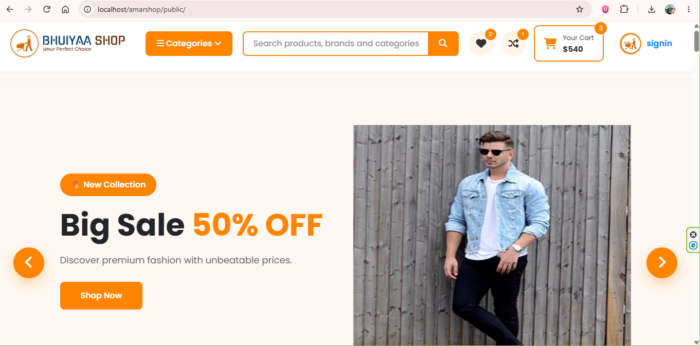
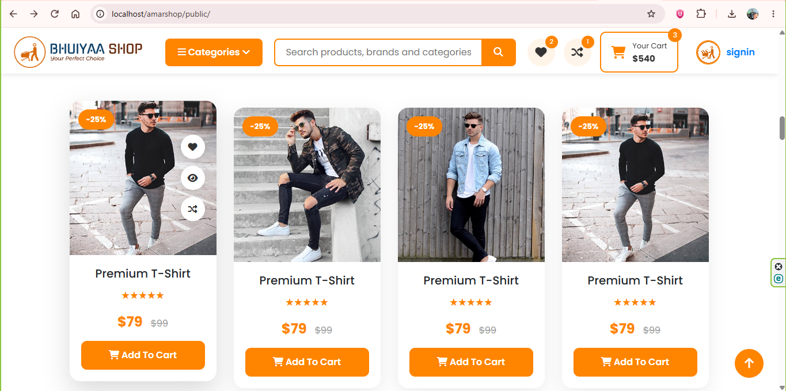
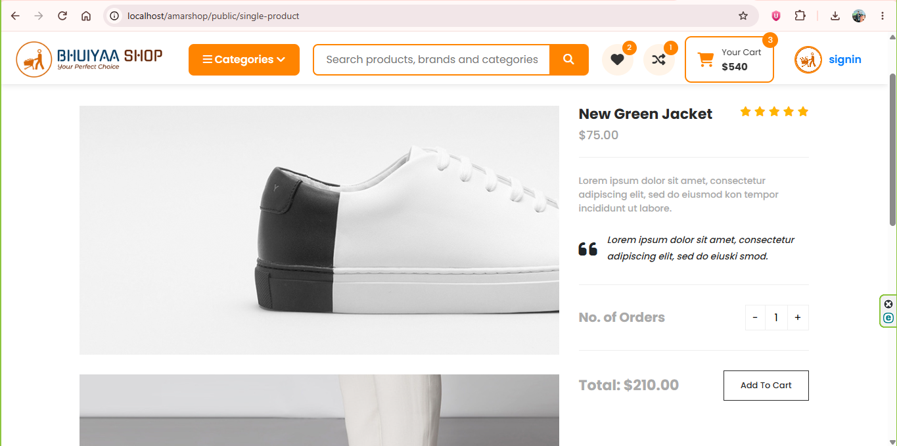
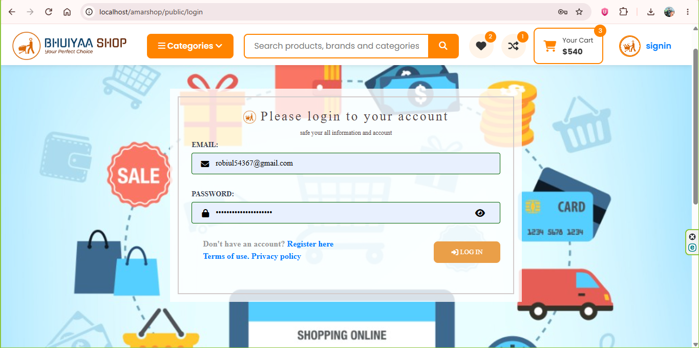
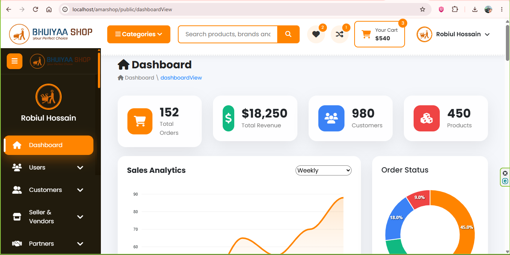

# AmarShop — Laravel E-commerce Web Application

A Laravel-based e-commerce web application built with PHP, Laravel, MySQL, Blade, JavaScript, jQuery, AJAX, and REST-oriented web development practices.

## 📌 Project Overview

AmarShop is an e-commerce web application developed with Laravel. The project includes customer-facing shopping functionality, product-related interfaces, wishlist and comparison features, authentication, dashboard management, user permissions, website configuration, and database-driven content management.

The project also demonstrates the migration and restructuring of an existing PHP/CodeIgniter-based application into the Laravel framework using Laravel's MVC architecture and modern application structure.

## 🚀 Key Features

* User authentication and login functionality
* Product browsing and product details
* Shopping cart functionality
* Wishlist management
* Product comparison
* Dashboard and administration features
* User type and permission management
* Website configuration and template management
* Database-driven content
* AJAX-based interactions
* Responsive web interface
* Laravel MVC architecture

## 🛠️ Technologies Used

### Backend

* PHP
* Laravel
* MySQL
* MVC Architecture

### Frontend

* HTML5
* CSS3
* JavaScript
* jQuery
* AJAX
* Responsive Web Design

### Development Tools

* Git
* GitHub
* Composer
* Vite
* Visual Studio Code
* XAMPP

## 🏗️ Laravel Concepts Used

* Routing
* Controllers
* Models
* Blade Templates
* Eloquent ORM
* Database Migrations
* Form Validation
* CRUD Operations
* Middleware
* Authentication
* Session Handling
* Database Integration

## 📂 Project Structure

```text
amarshop/
├── app/
│   ├── Http/
│   └── Models/
├── bootstrap/
├── config/
├── database/
│   ├── migrations/
│   ├── factories/
│   └── seeders/
├── public/
│   └── assets/
├── resources/
│   ├── css/
│   ├── js/
│   └── views/
├── routes/
├── storage/
├── tests/
├── composer.json
├── package.json
└── vite.config.js
```

## ⚙️ Installation

### 1. Clone the repository

```bash
git clone https://github.com/robiulhossainbhuiyaa/amarshop.git
cd amarshop
```

### 2. Install PHP dependencies

```bash
composer install
```

### 3. Create the environment file

```bash
copy .env.example .env
```

For Linux/macOS:

```bash
cp .env.example .env
```

### 4. Generate the application key

```bash
php artisan key:generate
```

### 5. Configure the database

Update the database settings in `.env`.

Example:

```env
DB_CONNECTION=mysql
DB_HOST=127.0.0.1
DB_PORT=3306
DB_DATABASE=amarshop
DB_USERNAME=root
DB_PASSWORD=
```

### 6. Run migrations

```bash
php artisan migrate
```

### 7. Start the Laravel development server

```bash
php artisan serve
```

The application will be available at:

```text
http://127.0.0.1:8000
```

## 🔐 Environment & Security

The `.env` file is intentionally excluded from version control.

Do not commit:

* Database passwords
* API keys
* SMTP credentials
* Application secrets
* Private production configuration

Use `.env.example` as the configuration template.

## 📸 Screenshots

### Homepage


### Products


### Product Details


### Login


### Dashboard



## 📚 Learning & Development

This project is part of my practical development work with Laravel, PHP, MySQL, JavaScript, AJAX, MVC architecture, database integration, and application maintenance.

## 👨‍💻 Author

**Robiul Hossain**

Web Developer | PHP | Laravel | CodeIgniter 4 | MySQL

Email: [robiulhossainbhuiyan@gmail.com](mailto:robiulhossainbhuiyan@gmail.com)

GitHub: https://github.com/robiulhossainbhuiyaa

## ⭐ Repository

This repository is maintained as part of my professional development and web development portfolio.
